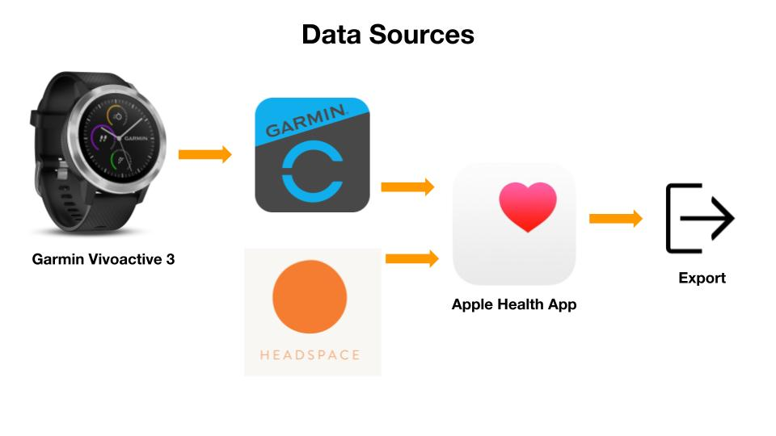

# Headspace + Apple Health Analysis

I set out to analyze my meditation habits and heart rate during my Headspace meditations using Garmin Connect and Apple Health data. 

* Check out the [Data_Cleaning.ipynb](https://github.com/Jmizraji/headspace-heartrate-analysis/blob/main/Data_Cleaning.ipynb) file to learn how to pull your own health and meditation data.
* Check out the [Tableau Visualizations](https://public.tableau.com/profile/joshua.mizraji#!/vizhome/HeadspaceMeditationAnalysis/MeditationDashboard) for additional analysis of the data.

***NOTE - Headspace and a wearable device must be synced with Apple Health app in order to pull this data**

